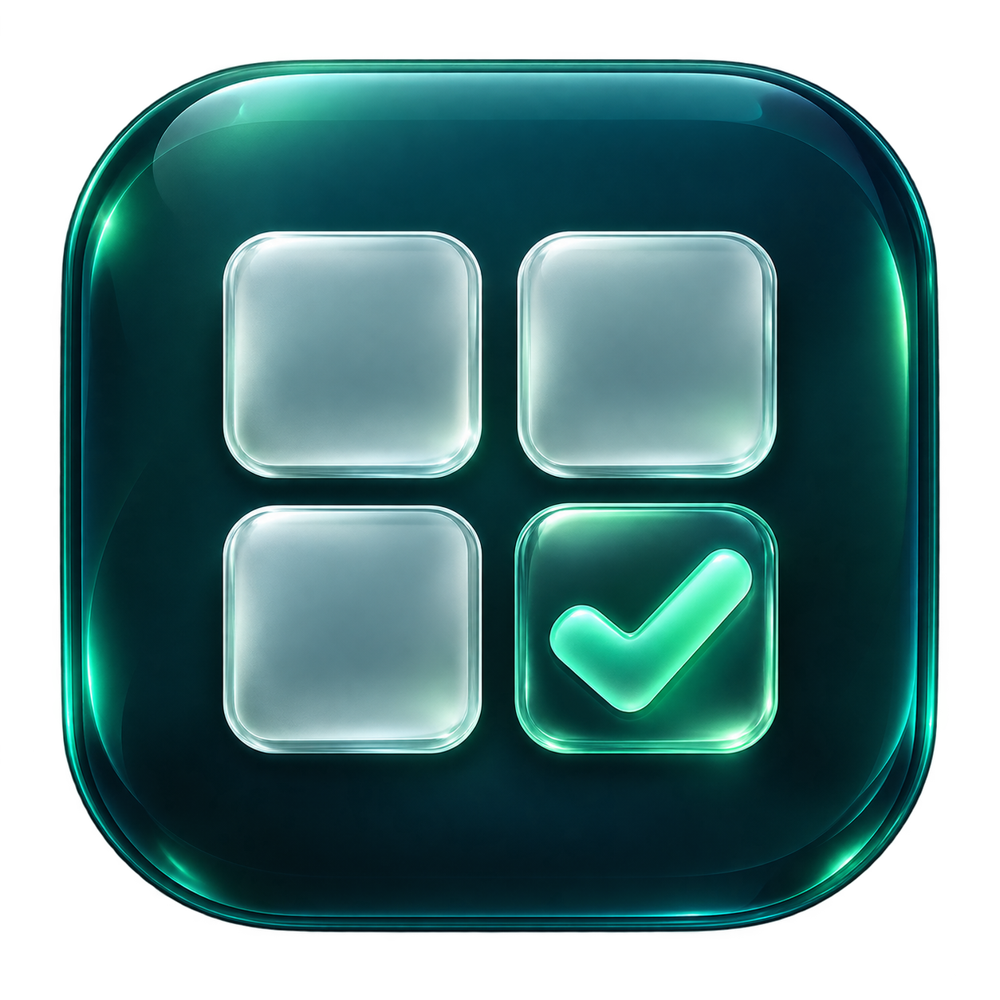

<p align="center">
  
</p>

<h1 align="center">拾题 · QuestionGlass</h1>
<p align="center">一个简单、离线的 macOS 刷题进度工具。</p>

输入题目总数，生成数字方块。做完一道，移除一道；下次打开，继续上次的进度。

## 功能

- **多个题库**：自定义名称与数量，支持 1–10,000 道题。
- **数字网格**：点击移除，支持撤销与 ⌘Z。
- **题号搜索**：快速确认题目还在、已移除或超出范围。
- **本地保存**：操作后立即保存，无需账号或网络。
- **日间 / 夜间**：一键切换并记住选择。
- **液态玻璃界面**：轻量过渡、悬停与按压反馈，支持减少动态效果。
- **删除确认**：题库列表右侧删除按钮，确认后才删除。

## 使用

要求 **Apple Silicon Mac、macOS 26 或更新版本**。

从 [Releases](../../releases) 下载应用压缩包，解压后将“拾题.app”放入“应用程序”文件夹。当前版本采用本地 ad-hoc 签名，未进行 Apple 开发者签名与公证。

打开后新建题库，输入总数即可。右上角太阳 / 月亮图标切换外观。

## 从源码构建

安装支持 macOS 26 SDK 的 Apple Command Line Tools，然后运行：

```sh
zsh build.sh
open build/拾题.app
```

运行存档逻辑测试：

```sh
swiftc -parse-as-library Sources/Library.swift Tests/LibraryTests.swift -o build/library-tests
build/library-tests
```

## 数据

进度存储于 `~/Library/Application Support/QuestionGlass/library.json`。备份或恢复前请退出应用。存档使用原子写入，读取失败时保留原文件，防止覆盖已有数据。

技术：SwiftUI、AppKit、Liquid Glass。图标由 image_gen 生成，源图见 [Assets/AppIcon.png](Assets/AppIcon.png)。
